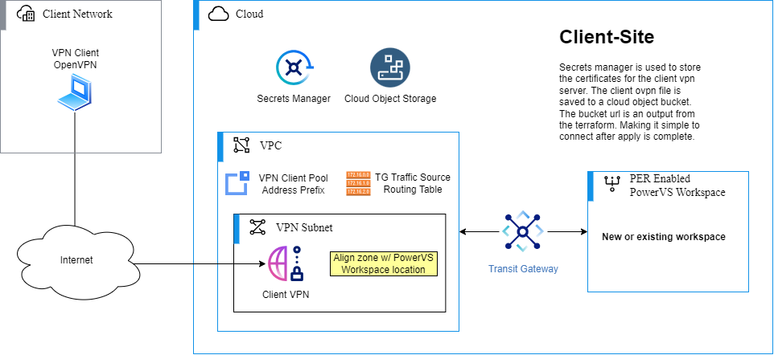
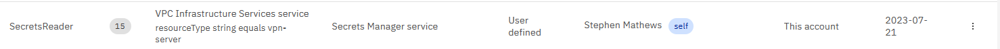
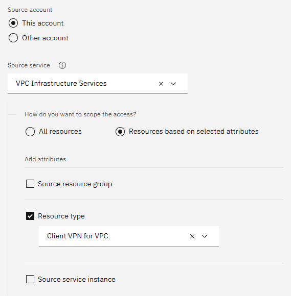
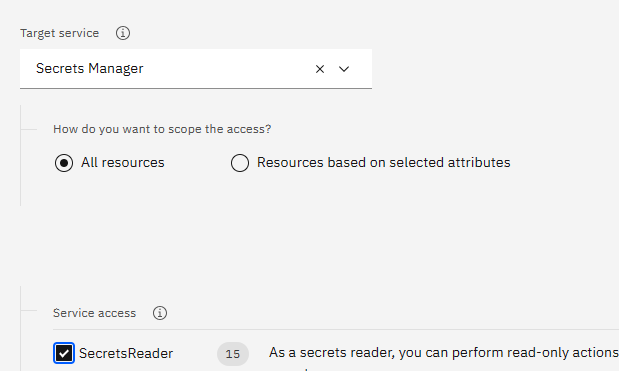

# PowerVPN Client to Site Server

## Overview

This Terraform module will create a VPC VPN Server and attach it to a new or existing PowerVS
Workspace. Providing secure access to IBM Cloud Power infrastructure.

This Terraform module deploys the following infrastructure:

- VPC
- VPC Subnet
- VPC Security Groups
- COS Bucket with OVPN file
- Secrets Manager Certificate
- PowerVS Workspace (Optional)
- Transit Gateway (Optional)
- Cloud Connection w/DirectLink* (Optional)

\* Only in locations without
[Power Edge Routers](https://cloud.ibm.com/docs/power-iaas?topic=power-iaas-per)

### Deployment Model

## Setup Requirements

### Prerequisites

#### Upgrading your IBM Cloud Account

To order and use IBM Cloud services, billing information is required for your account. See
[Upgrading Your Account](https://cloud.ibm.com/docs/account?topic=account-upgrading-account).

#### Install Terraform

If you wish to run Terraform locally, see
[Install Terraform](https://learn.hashicorp.com/tutorials/terraform/install-cli#install-terraform).

#### IBM Cloud API Key

You must supply an IBM Cloud API key so that Terraform can connect to the IBM Cloud Terraform
provider. See
[Create API Key](https://cloud.ibm.com/docs/account?topic=account-userapikey&interface=ui#create_user_key).

#### Secrets Manager

You must have in your account an [IBM Secrets Manager](https://www.ibm.com/cloud/secrets-manager).
This will be used to store the certificate created by this module for use with the VPN Server. The
Secret Manager may be located in any region or any Resource Group. To specify a different Resource
Group than the one used to create resources by this module, set the optional variable
`secret_manager_resource_group_name`.

You can create the Secrets Manager by visiting
[IBM Cloud Catalog - Create Secrets Manager](https://cloud.ibm.com/catalog/services/secrets-manager).

#### Authorization Policy

A privileged user for the account will need to
[create an authorization policy](https://cloud.ibm.com/iam/authorizations/grant) that will allow the
VPC VPN Service access to read secrets in the Secret Manager service(s). The policy should look
similar to this:

To create the authorization policy you must specify the Source service as
`VPC Infrastructure Services` and then choose to scope resources based on attribute by resource type
`Client VPN for VPC`. The Target service must be set to `Secrets Manager`. You may choose to limit
the scope (but it is not necessary) by various different attributes, including the exact instance
created in the [Secrets Manager Prerequisite](#secrets-manager) step above. Then allow Service
access of `SecretsReader`.

| Source Service | Target Service |
:---:|:---:
|  |  |

#### Object Storage

You must have in your account an [IBM Cloud Object Storage](https://www.ibm.com/cloud/object-storage)
instance. This will be used to store the OpenVPN configuration file created by this module. The COS
Instance may be located in any Resource Group. To specify a different Resource Group than the one
used to create resources by this module, set the optional variable
`cos_instance_resource_group_name`.

You can create the Object Storage instance by visiting
[IBM Cloud Catalog - Create Object Storage](https://cloud.ibm.com/objectstorage/create).

## Variable Behavior

There are a number of variables defined in variables.tf used by this Terraform module to deploy and
configure your infrastructure. This section will describe variable behavior. See
[variables.tf](./variables.tf) for full list of variables with their descriptions, defaults, and
conditions.

## Support

If you have problems or questions when using the underlying IBM Cloud infrastructure, you can get
help by searching for information or by asking questions through one of the forums. You can also
create a case in the
[IBM Cloud console](https://cloud.ibm.com/unifiedsupport/supportcenter).

For information about opening an IBM support ticket, see
[Contacting support](https://cloud.ibm.com/docs/get-support?topic=get-support-using-avatar).

To report bugs or make feature requests regarding this Terraform module, please create an issue in
this repository.

## References

- [What is Terraform](https://www.terraform.io/intro)
- [IBM Cloud provider Terraform getting started](https://cloud.ibm.com/docs/ibm-cloud-provider-for-terraform?topic=ibm-cloud-provider-for-terraform-getting-started)
- [IBM Cloud VPC VPN Server](https://cloud.ibm.com/docs/vpc?topic=vpc-vpn-client-to-site-overview)
- [IBM Cloud PowerVS](https://www.ibm.com/products/power-virtual-server)
<!-- BEGINNING OF PRE-COMMIT-TERRAFORM DOCS HOOK -->
## Requirements

| Name | Version |
|------|---------|
|  [terraform](#requirement\_terraform) | >= 1.0.0 |
|  [ibm](#requirement\_ibm) | 1.56.0 |
|  [random](#requirement\_random) | 3.5.1 |

## Providers

| Name | Version |
|------|---------|
|  [ibm](#provider\_ibm) | 1.56.0 |
|  [random](#provider\_random) | 3.5.1 |

## Modules

| Name | Source | Version |
|------|--------|---------|
|  [certificate](#module\_certificate) | ./modules/certificate | n/a |
|  [cloud\_connection](#module\_cloud\_connection) | ./modules/cloud-connection | n/a |
|  [cos\_upload](#module\_cos\_upload) | ./modules/cos-upload | n/a |
|  [ovpn](#module\_ovpn) | ./modules/ovpn | n/a |
|  [power](#module\_power) | ./modules/power | n/a |
|  [transit](#module\_transit) | ./modules/transit | n/a |
|  [vpc](#module\_vpc) | ./modules/vpc | n/a |
|  [vpn](#module\_vpn) | ./modules/vpn | n/a |

## Resources

| Name | Type |
|------|------|
| [random_string.resource_identifier](https://registry.terraform.io/providers/hashicorp/random/3.5.1/docs/resources/string) | resource |
| [ibm_resource_group.cos_instance](https://registry.terraform.io/providers/IBM-Cloud/ibm/1.56.0/docs/data-sources/resource_group) | data source |
| [ibm_resource_group.group](https://registry.terraform.io/providers/IBM-Cloud/ibm/1.56.0/docs/data-sources/resource_group) | data source |
| [ibm_resource_group.secret_manager](https://registry.terraform.io/providers/IBM-Cloud/ibm/1.56.0/docs/data-sources/resource_group) | data source |
| [ibm_resource_instance.power_workspace](https://registry.terraform.io/providers/IBM-Cloud/ibm/1.56.0/docs/data-sources/resource_instance) | data source |

## Inputs

| Name | Description | Type | Default | Required |
|------|-------------|------|---------|:--------:|
|  [cos\_instance\_name](#input\_cos\_instance\_name) | COS instance name to create a bucket with ovpn file in. | `string` | n/a | yes |
|  [cos\_instance\_resource\_group\_name](#input\_cos\_instance\_resource\_group\_name) | Resource Group the COS Instance is in. | `string` | `""` | no |
|  [data\_location\_file\_path](#input\_data\_location\_file\_path) | Where the file with PER location data is stored. This variable is used for testing, and should not normally be altered. | `string` | `"./data/locations.yaml"` | no |
|  [ibmcloud\_api\_key](#input\_ibmcloud\_api\_key) | The IBM Cloud platform API key needed to deploy IAM enabled resources. | `string` | n/a | yes |
|  [name](#input\_name) | The name used for the new Power Workspace, Transit Gateway, and VPC. Other resources will use this for their basename and be suffixed by a random identifier. | `string` | n/a | yes |
|  [power\_cloud\_connection\_speed](#input\_power\_cloud\_connection\_speed) | Speed of the cloud connection (speed in megabits per second). Supported values are 50, 100, 200, 500, 1000, 2000, 5000, 10000. | `number` | `1000` | no |
|  [power\_workspace\_location](#input\_power\_workspace\_location) | The location used to create the power workspace. Available locations are: dal10, dal12, us-south, us-east, wdc06, wdc07, sao01, sao04, tor01, mon01, eu-de-1, eu-de-2, lon04, lon06, syd04, syd05, tok04, osa21 Please see [PowerVS Locations](https://cloud.ibm.com/docs/power-iaas?topic=power-iaas-creating-power-virtual-server) for an updated list. | `string` | n/a | yes |
|  [power\_workspace\_name](#input\_power\_workspace\_name) | Name of an existing power workspace, if supplied the workspace will be used to connect the VPN with. Must be a PER enabled location. | `string` | `""` | no |
|  [resource\_group\_name](#input\_resource\_group\_name) | Resource Group to create new resources in (Resource Group name is case sensitive). | `string` | n/a | yes |
|  [secret\_manager\_name](#input\_secret\_manager\_name) | Secret Manager to create secret in. This maybe located in any Resource Group (use `secret_manager_resource_group_name`) or Region. | `string` | n/a | yes |
|  [secret\_manager\_resource\_group\_name](#input\_secret\_manager\_resource\_group\_name) | Resource Group the Secret Manager is in. | `string` | `""` | no |
|  [transit\_gateway\_name](#input\_transit\_gateway\_name) | Name of an existing transit gateway, if supplied it is assumed that you've connected your power workspace to it. A connection to the VPC containing the VPN Server will be added, but not for the Power Workspace. Supplying this will also supress Power Workspace creation. | `string` | `""` | no |
|  [vpn\_client\_cidr](#input\_vpn\_client\_cidr) | CIDR for VPN client ip pool space. | `string` | `"192.168.8.0/22"` | no |
|  [vpn\_subnet\_cidr](#input\_vpn\_subnet\_cidr) | CIDR for VPN subnet, change this if you have conflict in your VPC or with your Power Workstation Subnets. | `string` | `"10.134.0.0/28"` | no |

## Outputs

| Name | Description |
|------|-------------|
|  [bucket\_url](#output\_bucket\_url) | URL to bucket containing the OVPN file |
<!-- END OF PRE-COMMIT-TERRAFORM DOCS HOOK -->
